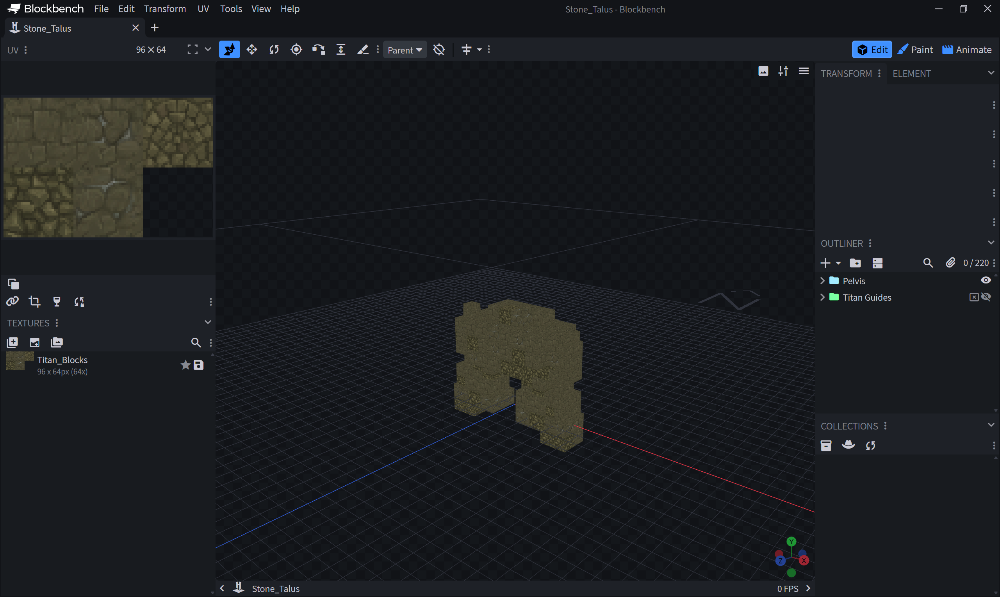
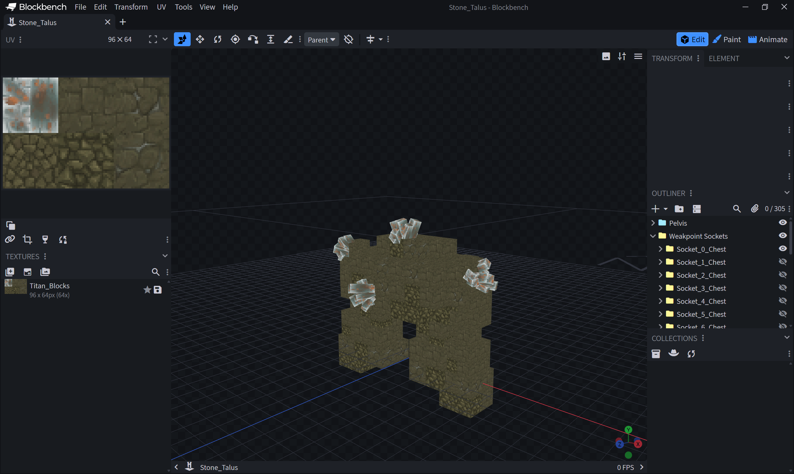

# Titan Rig — Blockbench plugin

Loads a Titan skeleton into Blockbench as a bone rig, fills each bone with the voxels of its prefab
using real Hytale block textures, and imports the skeleton's clip set as editable animations. Bone
edits and clip-set edits are written back into the mod's JSON in place.



## Requirements

- Blockbench 5.0.5 or newer, **desktop** app. The plugin reads files from disk, so the web version
  cannot run it.
- The official **Hytale** Blockbench plugin, which provides the `hytale_character` format and the
  `.blockyanim` codec this plugin builds on. Install it from Blockbench's plugin store first.
- An extracted copy of the Hytale assets, see below.

## Install

Blockbench: **File > Plugins > Load Plugin from File**, and pick `tools/blockbench/titan_rig.js`.

Blockbench remembers the file, so this survives a restart. Re-run the same menu item after pulling
changes to the plugin.

## Configure the two paths

Open **File > Titan Rig Paths...** and set both. They are also plain settings under
**Settings > Edit**, if you would rather type them.

**Titan Repo Root** — the root of this checkout, the folder holding `build.gradle.kts`. Everything
the plugin reads and writes in the mod is resolved from here:

| What | Where |
| --- | --- |
| Skeletons | `src/main/resources/Server/Titan/Skeletons` |
| Variants | `src/main/resources/Server/Titan/Variants` |
| Clip sets | `src/main/resources/Server/Titan/Clips` |
| Prefabs | `src/main/resources/Server/Prefabs` |
| Animations | `src/main/resources/Common` |

**Hytale Asset Root** — a folder containing `Common/` and `Server/`, used only for block textures.
Either the `HytaleAssets` folder of a shared-source checkout, or wherever you extracted `Assets.zip`.
The plugin also accepts the folder one level above either of those and finds the right one.

`Assets.zip` itself will not work, and the plugin says so rather than failing obscurely. Blockbench
hands plugins a restricted filesystem with no way to seek inside a file, only to read whole ones, and
the archive is about 3.5 GB. Extract it once:

```
%appdata%\Hytale\install\release\package\game\latest\Assets.zip
```

This is the same reason the official Hytale Avatar Loader asks for an extracted folder.

## Import a rig

**File > Import Titan Rig...**, pick a skeleton and optionally a variant.

The variant only chooses the rock-type suffix on each prefab name, so `Stone_Talus_Iron` loads the
iron prefabs. `BodyScale` is deliberately not applied: animation positions are authored in model
units and the runtime scales the whole rig at its root, so applying it here would make every
position you author wrong by that factor.

What you get:

- One group per bone, parented as the skeleton defines, with the bind rotation on the group.
- The bone's prefab as one cube per voxel, UV-mapped into a generated atlas of the real block
  textures. Blocks that draw as models rather than cubes, so slabs, vines and rubble, become a flat
  cell of their computed colour, since there is no cube texture to sample.
- Every clip in the skeleton's clip set as a Blockbench animation, at 60 fps snapping, with each
  animation's `path` pointing back at its `.blockyanim` so Blockbench's own save writes it in place.
- A **Weakpoint Sockets** group, one entry per `WeakpointSockets` socket, each wearing the ore the
  variant's `WeakpointModel` renders. These are editable, see below.
- A **Titan Guides** group, hidden and excluded from export, holding the IK rest targets. Bones on an
  IK chain with `Role: Foot` are tinted in the outliner, because the runtime solver overrides whatever
  you keyframe on them.

One model unit is one prefab block, and one Blockbench unit is one model unit, so the numbers in the
sidebar are the numbers in the JSON.

## Author animations

Work in Animate mode as usual. **Ctrl+S** saves the selected animation through the Hytale plugin's
`.blockyanim` exporter, straight back to the file it came from.

Two extra items live in the **Animation** menu:

- **Titan Clip Settings...** edits the selected clip's entry in the skeleton's clip set: looping,
  speed, blending duration, position scale, flip facing.
- **Register Titan Clip...** adds a new animation to the clip set and points it at a file, for clips
  you create in Blockbench rather than import.

Keyframe rotations are Euler degrees in the sidebar and quaternions in the file; the conversion is
handled on both sides. `smooth` interpolation maps to Blockbench's `catmullrom`.

## Edit the skeleton

Drag a bone's pivot to move it. **File > Save Titan Skeleton** derives `Offset` and `Rotation` from
the group transforms and writes them back.

**Titan Bone Properties...**, on the right-click menu of any bone group, covers the fields Blockbench
has no equivalent for: prefab, prefab yaw, pivot, scale, mirror X, and the collider flags. Changing any
of those only changes the file, so re-import to see the voxels move.

`PrefabYaw` turns a bone's blocks about Y as they are read, for a prefab that was built facing a
different way from the one the rig expects: the runtime's forward is `-Z`, so a prefab built facing east
needs `90`. The pivot is expressed in the turned coordinates, which is why the preview applies the turn
before working the bounds out — a rig whose prefab yaw the preview ignored would show every bone facing
the way it was authored while the game showed it facing forward.

### Weakpoint sockets



Each socket is a group holding the ore that socket would carry in game, read from the variant's
`WeakpointModel`: its `.blockymodel` boxes, its texture, its `WeakpointScale`, and the sink the spawner
applies so the node's centre, not its origin, lands on the socket. What you see is what will spawn.

The mesh is drawn at 64 units per block, which is the grid the client renders an entity model on. Block
art is authored at 32, so a mesh taken from `Blocks/` or `Resources/`, as the ore cluster is, draws at
half the size it was authored at. The sink is taken from the ModelAsset's declared `HitBox`, because
that is what the spawner reads: when a `HitBox` disagrees with the mesh the node ends up seated wrong in
game, and the preview shows it seated wrong too rather than quietly correcting it.

Every socket wears its ore, but only as many start visible as the variant actually rolls,
`WeakpointCountMax`. Showing all of them at once buries the body under ore no single titan carries, so
the rest are hidden and one outliner click away. The visible set is the most spread one, and it is the
same on every import, so placements stay comparable as you work.

Variants with no `WeakpointModel`, like the Yaga egg whose weakpoints are its own shell blocks, get a
magenta spike per socket instead.

**Position.** Drag a socket group and the save writes its new `Offset`. The offset is measured against
the bone the socket hangs off, which is the exact inverse of how the group was placed, so moving the
bone carries its sockets along without changing their numbers.

Keep them on the body surface. The spawner centres a weakpoint node on its socket and sinks it by the
variant's `WeakpointEmbed`, so a socket authored short of the surface ends up buried.

**Facing.** Rotate a socket group and the save writes a `Normal`. Left alone, the spawner aims each node
straight out from the bone pivot, which is already correct for a body slab that pivots at its own
centre. It is wrong for a limb that pivots at the joint it hangs from, where every socket down the
limb would otherwise point along the limb, and that is what `Normal` is for.

The field is only written for a socket you actually turned, or one that already had a `Normal`. Simply
sliding a socket along the surface changes the direction the spawner would derive, and pinning that on
every socket anyone nudged would bury the handful that genuinely need one. Turn one back to the
derived direction and the field is removed again.

Each group keeps the index of the entry it came from, so renaming or reordering them in the outliner
is safe. Adding a group by hand does nothing: the write-back only updates sockets that already exist
in the file.

Write-back splices the original text rather than reprinting the JSON, so `$Comment` blocks, blank
lines, inline vectors and trailing `.0` on whole numbers all survive. A single dragged bone changes a
single line in the diff.

## Tests

`node harness.mjs` in the test folder exercises the import maths, the prefab reader, the JSON editor
and the write-back against the real mod files, with no Blockbench involved. One case runs a full rig
build against a filesystem stub restricted to exactly the methods Blockbench's sandbox exposes, which
is what catches a call like `fs.openSync` before a user does.

`node drive.mjs` attaches to Blockbench over the DevTools protocol, loads the plugin the same way the
menu item does, drives the real import dialog and reports what ended up in the scene.
